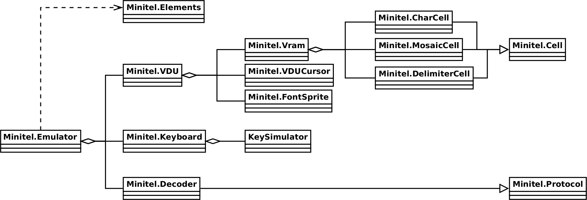

The Minitel emulator
====================

The MiEdit project comes with a Minitel Emulator which can be used independantly
provided that you can write some lines of code.

HTML code
---------

The Minitel emulator does not create visible elements on your page, they must
already exist or dynamically created (this option won't be discussed here).

The following code is needed to have a Minitel emulator with keyboard and cursor
functionalities:

    <x-minitel data-socket="ws://mntl.joher.com:2018/?echo"
               data-speed="0"
               data-color="true">
        <canvas data-minitel="screen"></canvas>
        <canvas data-minitel="cursor"></canvas>

        <import src="import/minitel-keyboard.html"></import>

        <audio data-minitel="beep">
            <source src="sound/minitel-bip.mp3" type="audio/mpeg"/>
            Too bad, your browser does not support HTML5 audio or mp3 format.
        </audio>      
    </x-minitel>

### The `x-minitel` tag

The `x-minitel` tag is a custom tag container for one Minitel emulator. You can
have as many `x-minitel` tag as you want on a page.

The only mandatory element it must contain is a `canvas` with the `data-minitel`
attribute set to `screen`. The emulator won’t complain if a keyboard or cursor
are missing from the container.

The `x-minitel` tag supports these custom attributes:

- `data-socket`, a web socket to which the emulator will connect. If it is
  missing, you will have to directly feed the emulator using its `send` method.
- `data-speed`, the speed the emulator should use, it can be either 0, 1200,
  4800 or 9600. 1200 is the standard Minitel speed, 4800 was used by
  administrators on local Minitel, 9600 was used by the photographic Minitels.
  0 means the emulator will run as fast as your computer/browser/network will
  allow.
- `data-color`, true to use colors, false to use grayscales.

The speed and color settings can be dynamically set later by program.

### The `canvas data-minitel="screen"` tag

This is the only mandatory element and should be the first.

It will be used by the emulator to draw the image on.

### The `canvas data-minitel="cursor"` tag

This is an optional element.

It will be used by the emulator to draw a blinking cursor on when the Videotex
stream requires it.

It is the responsibility of the CSS stylesheet to place this canvas above the
screen canvas to achieve the desired result. It should also ignore pointer
events:

    canvas[data-minitel="cursor"] {
        position: absolute;
        top: 0;
        left: 0;
        pointer-events: none;
    }

### The `div data-minitel="keyboard"` tag

This is an optional element.

It will be used by the emulator to display a virtual keyboard and handles key
strokes.

A standard Minitel keyboard is available in `import/minitel-keyboard.html`.

You can write and style your own keyboard but each key must have the `data-call`
and `data-param` set accordingly to the standard Minitel keyboard, otherwise the
emulator won’t be able to receive key clicks.

### The `audio data-minitel="beep"` tag

This is an optional element.

It will be used by the emulator to emit a beep sound when then Videotex stream
requires it.

You can use any sound you like instead of the standard one.

Running the Minitel emulator
----------------------------

### Required files

The following files are required in order for the emulator to work:

- `library/generichelper/generichelper.js`, some unrelated functions to make
  programming easier.
- `library/import-html/import-html.js`, handles any `import` tag (used in the
  example to import the keyboard HTML code).
- `library/autocallback/autocallback.js`, associates `data-call` and
  `data-param` to their correspond handlers.
- `library/query-parameters/query-parameters.js`, read parameters from the
  query string.
- `library/finite-stack/finite-stack.js`, a finite stack that never overflows.
- `library/key-simulator/key-simulator.js`, simulates the sound a keyboard key
  makes when used.
- `library/settings-suite/settings-suite.js`, handles settings given through
  various ways (query parameters, data attribute, function argument or default
  value).
- `library/minitel/constant.js`, every Minitel constants are here. And the
  automaton too.
- `library/minitel/protocol.js`, the Videotex stream decoder.
- `library/minitel/elements.js`, an helper class to retrieve elements of the
  Minitel emulator from the DOM.
- `library/minitel/text-grid.js`, handles text grid dimensions.
- `library/minitel/char-size.js`, handles character size in pixels.
- `library/minitel/font-sprite.js`, load and draw sprite fonts.
- `library/minitel/page-cell.js`, a Videotex cell in the video RAM.
- `library/minitel/vram.js`, the video RAM.
- `library/minitel/vdu-cursor.js`, the blinking cursor.
- `library/minitel/vdu.js`, the visual display unit which controls video RAM and
  blinking cursor.
- `library/minitel/decoder.js`, the "boss" which knows what to do with the
  Videotex stream.
- `library/minitel/keyboard.js`, the keyboard.
- `library/minitel/minitel-emulator.js`, the emulator itself which will connect
  every part to each other.
- `library/minitel/start-emulators.js`, an helper function instanciating a
  `Minitel.Emulator` object for each `x-minitel` tag found in the DOM.

These files should be imported in this order.

They can be concatenated and minified in order to save bandwidth.

### Start the emulator

The Minitel emulator is run by instanciating the `Minitel.Emulator` class.

The emulator comes with a `startEmulators` helper function.

Running every emulator present on a page is as simple as:

    const emulators = Minitel.startEmulators()

This works well when settings are defined as `x-minitel` attributes.

If you want to specify settings other way, you will have to directly use the
`Minitel.Emulator` class, which is not that difficult to do.

### Specifying settings

Settings can be specified multiple ways. The priority order is the following:

- query parameters,
- function argument,
- `data-*` attribute,
- default value.

Classes
-------

A Minitel emulator instance is mainly composed of the following classes:

