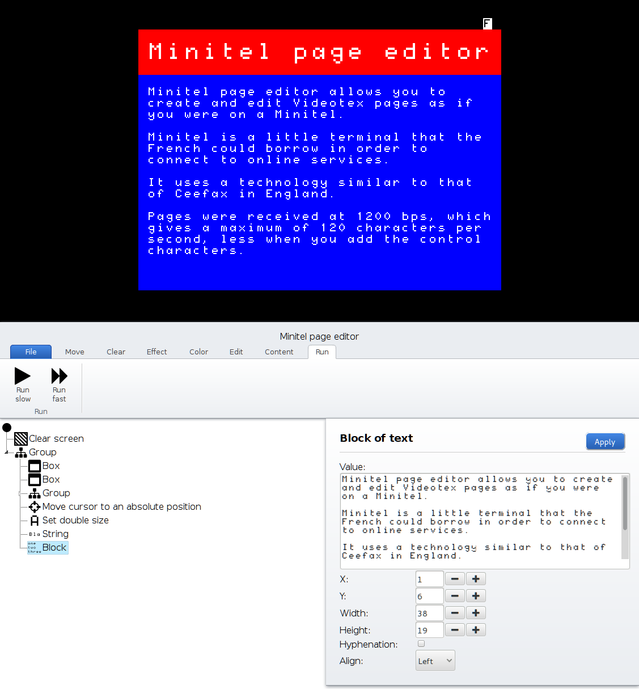
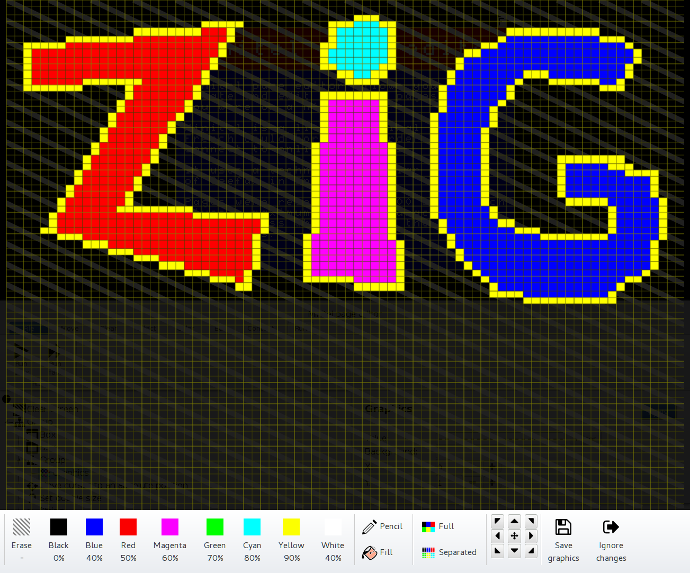

Minitel page editor
===================

Minitel page editor allows you to create Minitel pages in a web browser.

See it in action → https://www.youtube.com/watch?v=WQ9C6MdD4Tk

This is work in progress!

What is a Minitel?
------------------

Something that the French designed :-)

More information → https://en.wikipedia.org/wiki/Minitel

Using the emulator without the editor
-------------------------------------

You can use the Minitel emulator without the Minitel page editor for your own
project.

See [EMULATOR.md](EMULATOR.md) page.

Requirements
------------

Your browser must support:

- EcmaScript 6
- HTML5 canvas and web storage

At the time of this writing, Firefox supports running the pages without any web
server. Chrome won't allow you for security reasons.

Screenshots
-----------

